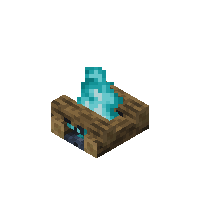

[](docs/soul_campfire.png)

minecraft-render
=======================


Renders minecraft block models from .jar file using `THREE.js`. 
Output format is PNG `1000x1000`.


### Pre-rendered assets

You can find pre-rendered assets on Github Actions artifacts. By clicking the badge down below, you can access action list.

[](https://github.com/co3moz/minecraft-render/actions/workflows/ci.yml)


### Binaries

Basic usage;

```sh
npx minecraft-render minecraft-version.1.17.1.jar output-folder/
```

```sh
...
[0168 / 1710] observer rendered to output-folder\observer.png
[0169 / 1710] comparator_on_subtract skipped due to "no gui"
[0170 / 1710] template_trapdoor_open skipped due to "no gui"
...
```

### Using Rendering API

```ts
import { Minecraft } from 'minecraft-render';
import fs from 'fs';

async function main() {
  const minecraft = Minecraft.open('./minecraft-version.1.17.1.jar');
  const blocks = await minecraft.getBlockList();

  for await (const block of minecraft.render(blocks)) {
    if (!block.buffer) {
      console.log(`${block.blockName} skipped due to ${block.skip}`);
      continue;
    }

    await fs.promises.writeFile(`./render/${block.blockName}.png`, block.buffer);
  }
}
```


### Tests

Current test configuration is capable of downloading jar files from mojang servers and execute render sequence. You can trigger tests with;

```sh
npm test
```